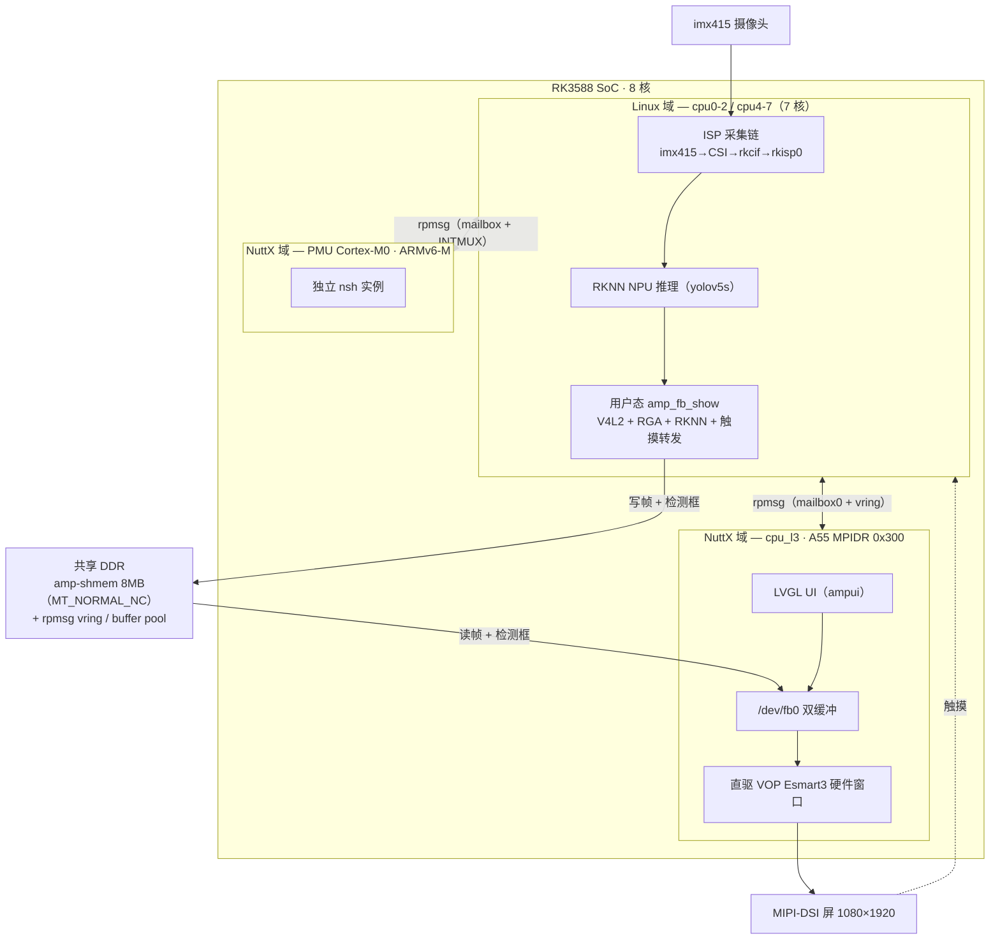
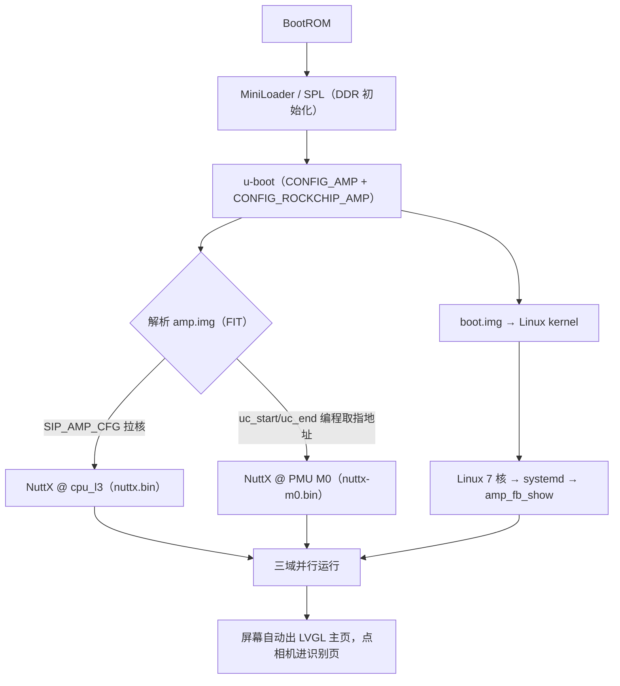
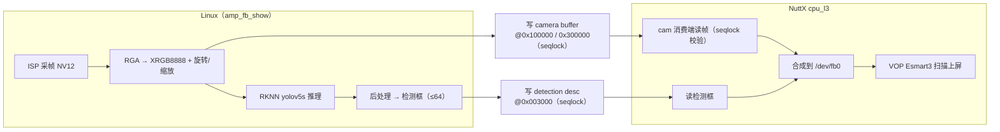
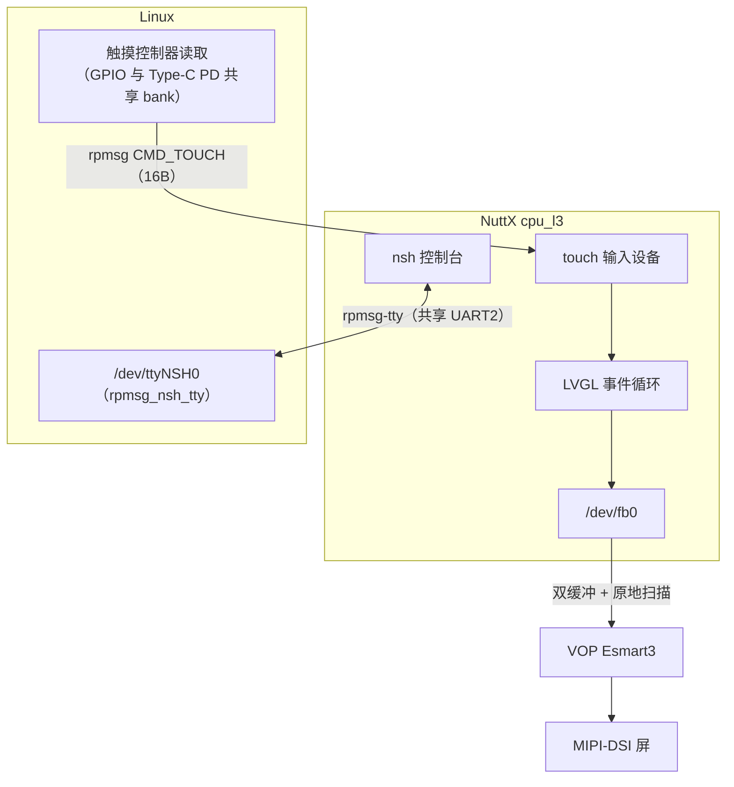

# 人物识别摄像头

在一块 RK3588 开发板上，让 **openvela(NuttX) 与 Linux 真正同时运行在同一颗 SoC 上**，
由 NuttX 负责屏幕与交互，Linux 负责摄像头与 NPU，两者通过 rpmsg + 共享内存协作，
最终呈现一个「实时人物识别摄像头」。

---

## 一、作品简介

**一句话**：把 openvela 移植到 RK3588 的一颗 A55 和一颗 PMU Cortex-M0 上，
与 Linux 三域并行，做成一个 NuttX 出画面、Linux 出算力的实时人物识别摄像头。

**它解决什么问题。**
AI 硬件常见的两难：想要 RTOS 的确定性与低启动延迟（UI 不卡、可控），
又需要 Linux 那套庞大的驱动生态与 NPU 工具链（摄像头 ISP、RKNN 都只有 Linux 有）。
通常只能二选一，或者上两颗芯片。本作品在**一颗 SoC 内部**用 AMP 把两者合起来：

- **NuttX（cpu_l3）**：直接编程 VOP 的 Esmart3 硬件窗口把自己的 framebuffer 扫上屏，
  跑 LVGL 界面，处理触摸。不依赖 Linux 的图形栈，Linux 崩了它照样在画。
- **Linux（7×A55）**：拥有 imx415 → CSI → ISP 这条深度驱动的采集链，以及 RKNN NPU 推理。
- **NuttX（PMU Cortex-M0）**：第三个域，独立 RTOS 实例，验证了这颗一直闲置的 M0 可用。

**亮点。**

1. **三个域、两种指令集、两个独立 NuttX 实例，共用一根调试串口。**
   两个 NuttX 的 nsh 都通过 rpmsg 隧道成 Linux 侧的 `/dev/ttyNSH0` / `/dev/ttyNSH1`，
   不占物理 UART，随时可交互调试。
2. **把 RK3588 的 PMU Cortex-M0 点亮并跑上了 NuttX。**
   这颗 M0 在官方 RK3588 AMP 参考里只占一块保留内存，没有 rpmsg link、没有示例固件。
   我们从 TRM 的地址重映射表推出取指窗口/外设窗口/SysTick，做出了完整的 ARMv6-M chip 层
   （`arch/arm/src/rk3588-m0/`），并让它也跑起了 nsh。
3. **NuttX 侧显示不经过 Linux。** 从 Linux 的 VOP 手里摘出一个硬件图层（reserved-plane），
   NuttX 双缓冲 + 原地扫描，无 memcpy、无撕裂。
4. **修了一个 NuttX 通用层的 bug 和一个 GICv3 通用缺陷**，不只是加板级代码：
   - `arm64_gicv3.c`：原来按 `up_cpu_index()` 算 redistributor 基址，AMP 下永远选中 cpu0 的
     GICR，从核的 timer PPI 永远不使能。改为按 MPIDR affinity 匹配 `GICR_TYPER` 探测本核。
   - `drivers/serial/uart_rpmsg.c`：`dmasend` 阻塞等发送缓冲会与对端互锁；首次 NS announce
     必丢且不重试。均已修正。
5. **全链开机自启动**，上电即用，不需要手敲任何命令。

**实测数据**（真机，非估算）：
相机页 21.2 fps（71 个周期统计）；双路 ISP 两路满帧零丢帧（30.0 / 30.2 fps，`gaps 0/0`）；
NPU 推理均值 22.1ms；`person` 是检出最多的类；零断言、零应用层报错、冷启动 ×2 顺序一致。

---

## 二、选题方向

**新硬件适配**（主）。

理由：本作品的主体工作量是把 openvela 移植到两个此前不被支持的目标上 ——

| 目标 | 此前状态 | 我们做了什么 |
|---|---|---|
| RK3588 A55（cpu_l3, AArch64） | openvela 只有 rk3399 的 arm64 chip 层 | 新建 `arch/arm64/src/rk3588/` 完整 chip 层 + `boards/arm64/rk3588/evb7-amp/` |
| RK3588 PMU Cortex-M0（ARMv6-M） | **完全没有**，官方 AMP 参考也没有 | 新建 `arch/arm/src/rk3588-m0/` + `boards/arm/rk3588-m0/evb7-m0/` |

移植不是"能打印 hello"就算完 —— 定时器、GIC 与 Linux 共存、rpmsg 传输层、中断化接收、
MMU/cache 一致性、控制台复用，每一层都在真机上验证过，并且顺手修了 NuttX 通用层的两处缺陷。

**同时也覆盖 AI 硬件产品创新**：成品本身是一个带 NPU 实时人物识别的摄像头终端，
LVGL 界面 + 触摸交互 + 开机自启，是可演示的产品形态，不只是移植 demo。

---

## 三、设计架构

一句话概括：**一颗 RK3588 SoC 内部切成三个域并行运行**——Linux 拿 7 个核负责采集与算力，
NuttX 拿一个 A55（cpu_l3）负责画面与交互，NuttX 再拿那颗一直闲置的 PMU Cortex-M0 做第三个
独立 RTOS 实例。三者通过 **rpmsg（rockchip mailbox + OpenAMP vring）** 与一块 **非缓存共享内存**
协作。下面依次给出总体架构、模块组成、启动流程、三条运行期数据流，以及内存/链路的地址契约。

### 3.1 总体架构：一颗 SoC 上的三个域



要点：

- **显示不经过 Linux。** NuttX 从 Linux 的 VOP 手里摘出一个硬件图层（Esmart3，reserved-plane），
  自己双缓冲 + 原地扫描上屏；Linux 图形栈崩了，画面照在。
- **算力不重造。** 摄像头 ISP 链和 NPU 只有 Linux 有深度驱动，NuttX 不碰硬件，只从共享内存读结果。
- **触摸走消息通道。** 触摸控制器中断与 Type-C PD 控制器共用一个 GPIO bank，NuttX 无法独占，
  改由 Linux 读取后经 rpmsg 转发。

### 3.2 模块组成

| 域 | 模块 | 源码位置 | 职责 |
|---|---|---|---|
| Linux | ISP 采集链 | vendor kernel（BSP） | imx415→csi2_dphy0→mipi2_csi2→rkcif→rkisp0，产出 NV12 帧 |
| Linux | NPU 推理 | `rk3588-amp-demo/npu-a17/` | RKNN 运行时 + yolov5s 模型，输出检测框 |
| Linux | `amp_fb_show` | `rk3588-amp-demo/amp_fb_show.c` | V4L2 采集 + RGA 转换/旋转 + RKNN 推理 + 写共享内存 + 触摸转发 |
| Linux | rpmsg 隧道 | `kernel/drivers/tty/rpmsg_nsh_tty.c` + `rpmsg_char` | 把两个 NuttX 的 nsh 暴露成 `/dev/ttyNSH0/1` |
| Linux | 部署 | `rk3588-amp-demo/deploy/` | 4 个 systemd unit（WiFi/BT/rpmsg/camera）+ install.sh |
| NuttX cpu_l3 | chip 层 | `nuttx/arch/arm64/src/rk3588/` | GICv3(rdist 修复)/EL1 物理 timer/rptun/rsctable/boot MMU/serial |
| NuttX cpu_l3 | board 层 | `nuttx/boards/arm64/rk3588/evb7-amp/` | fb / vop / cam / touch / shm / bringup |
| NuttX cpu_l3 | 应用 | `apps/examples/ampui`、`apps/examples/ampcam` | LVGL 主页+相机页；帧查看与统计 |
| NuttX M0 | chip 层 | `nuttx/arch/arm/src/rk3588-m0/` | irq(INTMUX→NVIC)/SysTick/rptun/lowputc/地址重映射模型 |
| NuttX M0 | board 层 | `nuttx/boards/arm/rk3588-m0/evb7-m0/` | 启动/板级初始化/nsh |
| 通用层修复 | — | `arm64_gicv3.c`、`arm64_arch_timer.c`、`drivers/serial/uart_rpmsg.c` | AMP 下的 3 处 NuttX 通用缺陷修复 |

### 3.3 启动流程



> ⚠️ M0 那一路的 `uc_start`/`uc_end` 不是可选项：缺了它 u-boot 会静默落进 `__weak` 空桩、
> **照样打印 `...OK`**，而 M0 取指地址从未编程。详见 §五 的踩坑说明。

### 3.4 运行期数据流

**（a）相机识别链**——数据真正起源于 Linux，交接点是共享内存：



**（b）显示回路 + （c）触摸与 nsh 通道**——显示全程不出 NuttX；触摸与控制台走 rpmsg：



三条消息/数据通道的载体各不相同，取决于「数据是流还是快照」：

- **触摸 = 事件流** → 定长 16 字节 rpmsg 消息（`CMD_TOUCH`）。
- **检测框 = 快照**（一帧内全部框、数量可变）→ 共享内存 + seqlock，一次读到全一致的一组。
- **相机帧 = 大块图像** → 共享内存 2MB 槽 + seqlock。

### 3.5 地址与链路契约

**内存布局**（Linux dts 保留 + NuttX 侧 MMU 映射，两侧必须一致）：

| 区域 | 地址 | 大小 | 说明 |
|---|---|---|---|
| amp-core | `0x30000000` | 16MB（no-map） | NuttX cpu_l3 固件代码/数据 |
| amp-shmem | `0x31000000` | 8MB（no-map, MT_NORMAL_NC） | 帧/相机/检测/触摸共享区（非缓存，免 cache 维护） |
| rpmsg vring0 / vring1 | `0x07c00000` / `0x07c08000` | — | cpu_l3 ↔ Linux 环形队列 |
| rpmsg buffer pool | `0x08000000` | — | rpmsg 数据缓冲 |
| M0 心跳计数 / 取指窗口 | `0x07ae0000` / `0x60000000` | — | M0 活体递增计数 / M0 访问共享 DDR 的窗口 |
| UART2 | `0xfeb50000` | — | u-boot/Linux/NuttX 共享控制台，1500000 8N1 |
| GICD / GICR(cpu_l3) | `0xfe600000` / `0xfe6c0000` | — | 中断分发 / 本核 redistributor（按 MPIDR 亲和度定位） |

**amp-shmem 内部布局**（契约唯一定义在 `evb7_amp_shm.h`，Linux 侧持一份副本）：

| 偏移 | 内容 | 写者 → 读者 |
|---|---|---|
| `0x000000` | 保留首页 4KB | 项目外未知写者，整块跳过 |
| `0x001000` | fb 控制块 | NuttX → Linux |
| `0x002000` | 相机描述符 | Linux → NuttX |
| `0x003000` | 检测结果描述符（≤64 框） | Linux → NuttX |
| `0x100000` | 相机 buffer 0（2MB 槽） | Linux → NuttX |
| `0x300000` | 相机 buffer 1（2MB 槽） | Linux → NuttX |
| `0x500000` | 备用 3MB | — |

**rpmsg 链路**：

| 链路 | 载体 | 机制 |
|---|---|---|
| cpu_l3 ↔ Linux | mailbox0 + 固定 vring | **TX** 事件驱动（写 B2A_DAT+B2A_CMD 敲门铃）；**RX** 轮询 A2B_STATUS（中断被 GIC Group0 挡住，代码保留完整中断路径，secure 侧放开即接管） |
| M0 ↔ Linux | mailbox + INTMUX→NVIC | 中断驱动收发 |
| nsh 隧道 | rpmsg-tty | 两个 NuttX 的 nsh → Linux `/dev/ttyNSH0`(cpu_l3) / `/dev/ttyNSH1`(M0)，不占物理 UART |

> 这些地址与偏移为什么是这些值、每一个踩过的坑（如 amp-shmem 从 4MB 长到 8MB 要同时改 dts、
> MMU 表、头文件三处），逐条记录在 `logs/.kiro/board-changes/rk3588-evb7-v11.md`。
> 源码/patch 的具体位置见 §四，构建与刷机见 §五。

---

## 四、目录结构

### 4.1 本仓目录

```text
contest2026_160_xiangyonghusuoxiangdui/
├── README.md                          本文件
├── rk3588-amp-demo/                   ★ AMP 载荷 + Linux 用户态 + 主机侧回归（本作品运行的核心目录）
│   ├── amp1.c / amp_start.S / amp.ld  最早的 A55 裸机验证固件（AMP 拉核链路的第一块试金石）
│   ├── build.sh                       编译上面那个裸机固件
│   ├── amp.its / amp-nuttx.its / amp-m0.its / amp-m0-nuttx.its
│   │                                  FIT 描述，逐步演进：裸机 → 单 NuttX → cpu_l3+M0 双固件
│   ├── amp.img                        打包产物：一个 FIT 同时装 cpu_l3 与 M0 两个固件
│   ├── parameter-amp.txt              分区表：在官方分区表上加 16MB `amp` 分区
│   ├── amp_fb_show.c                  ★ Linux 侧主程序：V4L2 采集 + RGA + RKNN 推理 + 旋转 + 发布
│   ├── amp_isp_range.c / amp_npu_probe.c / amp_rga_probe.c
│   │                                  上板探针小程序（ISP 范围 / NPU / RGA 能力验证）
│   ├── amp_shm_test.c / amp_shm_scan.c   共享内存契约的读写与扫描验证
│   ├── nuttx.bin                      cpu_l3 NuttX 固件产物
│   ├── m0/                            M0 侧裸机与固件（m0_start.S / m0.ld / build-m0.sh / nuttx-m0.bin）
│   ├── deploy/                        板上部署：4 个 systemd unit + install.sh / selftest.sh + wifi 配置
│   ├── npu-a17/                       RKNN 运行时（librknnrt.so / librga.so / yolov5s 模型 / 标签）
│   ├── tests/                         主机侧回归：yolo 解码对比 + emit + 触摸解码
│   └── _a55_backup/                   各里程碑 amp.img 备份（回退用，对应关系见 SETUP）
├── demo-video/                        ★ 成品演示材料（真机录制）
│   ├── evb7演示.mp4                    实机演示视频（三域并行 + 相机识别 + 触摸 UI）
│   ├── 技术报告.md / 技术报告.pdf      技术报告
│   ├── 演示日志ttyUSB0_20260906_184139.log  完整开机串口日志（三域启动全过程）
│   └── 演示日志log.log / 演示日志log1.log    关键片段日志
├── board/                             ★ 本作品对四棵上游源码树的改动（相对上游基线的合并 diff，见 §4.3）
│   ├── Rockchip_kernel/
│   │   └── rk3588-evb7-v11-amp-kernel.patch      内核（8 文件）：AMP dts、G610/WiFi-BT config、rpmsg_nsh_tty
│   ├── Rockchip_u-boot/
│   │   └── rk3588-evb7-v11-amp-uboot.patch       u-boot（1 文件）：rk3588_defconfig 开 CONFIG_AMP
│   ├── nuttx/
│   │   └── rk3588-evb7-v11-amp-nuttx.patch       NuttX（68 文件）：两套 chip 层 + 两套 board 层 + 3 处通用 arch 修复
│   ├── apps/
│   │   └── rk3588-evb7-v11-amp-apps.patch        NuttX apps（8 文件）：examples/ampui + examples/ampcam
│   └── contest_board/                            赛题板级形态占位骨架（模板，非本作品代码）
├── app/hello_app/                     应用形态占位（本作品的 NuttX 应用见 §4.2）
├── quickapp/hello_quickapp/           快应用占位（本作品未使用）
└── logs/                              AI Coding 日志（见 §六）
    ├── e0295e74ccbf7137/              Kiro 会话原始记录（session.json + messages.jsonl）
    ├── e0295e74ccbf7137.jsonl         会话索引
    └── .kiro/
        ├── board-changes/             ★ 开发全过程的工程日志，见 §4.4
        │   ├── rk3588-evb7-v11.md                                 主 changelog，6684 行，逐个里程碑
        │   ├── SETUP-rk3588-evb7-v11.md                           从零搭建手册（评委复现看这份）
        │   ├── HANDOFF-rk3588-evb7-v11.md                         板级适配 + NuttX AMP 移植交接
        │   ├── HANDOFF-rk3588-amp-peripheral-sharing-20260730.md  外设共享机制调研（VOP/NPU/触摸/摄像头）
        │   ├── rk3588-evb7-v11-AMP-overview.md                    AMP 项目总览（拓扑 / 交付栈）
        │   └── rk3588-evb7-v11-SESSION-SUMMARY.md                 会话交接总结（能力矩阵）
        └── skills/                    自定义 AI skill（见 §六）
            ├── board-change-tracker/
            └── session-handoff/
```

> **`logs/.kiro/board-changes/rk3588-evb7-v11.md` 是理解本作品最快的入口。**
> 它按里程碑记录了每一步改了什么、为什么、真机验证结果，以及**每一次判断错误和它的根因**
> （包括三次被"看起来像成功的返回值"骗到的经过）。这份文档本身就是 AI 协作的产物与证据。

### 4.2 改动仓库汇总

下表列出本项目**发生过代码改动**的全部仓库，及其远端地址（fork 分支 / 上游 PR）。
这些树 `repo sync` 后位于 openvela 工作区中。

| 仓库 | 本地路径 | 分支 | 改动内容概述 | GitHub |
|------|---------|------|-------------|--------|
| kernel（Rockchip BSP 6.1.141） | `/media/1t/openvela/kernel` | develop-6.1 | AMP dts（`rk3588-evb7-v11-linux-amp.dts`：cpu_l3 摘核、amp/rpmsg 保留区、reserved-plane、关 vop_mmu）；kernel fragment `rk3588_g610.config` / `rk3588_wifibt.config`；新驱动 `drivers/tty/rpmsg_nsh_tty.c`；`rpmsg_char`/`rpmsg_ctrl`/`rockchip_rpmsg_test` 配置 | [C-Ackerman/kernel @rk3588-evb7-v11](https://github.com/C-Ackerman/kernel/tree/rk3588-evb7-v11) |
| u-boot（vendor 2017.09） | `/media/1t/openvela/u-boot` | next-dev | `configs/rk3588_defconfig` 追加 `CONFIG_AMP=y` + `CONFIG_ROCKCHIP_AMP=y` | [C-Ackerman/u-boot @rk3588-evb7-v11](https://github.com/C-Ackerman/u-boot/tree/rk3588-evb7-v11) |
| work/nuttx（openvela NuttX） | `/media/1t/openvela/work/nuttx` | 0712 | 新增 arm64 chip 层 `arch/arm64/src/rk3588/`（GICv3 rdist 修复、EL1 物理 timer、rptun、rsctable、共享内存非缓存）+ board `boards/arm64/rk3588/evb7-amp/`（fb/touch/shm/vop/cam）；新增 armv6-m chip 层 `arch/arm/src/rk3588-m0/` + board `boards/arm/rk3588-m0/evb7-m0/`；通用驱动 `drivers/serial/uart_rpmsg.c` re-announce 改动 | [fork @rk3588-evb7-v11](https://github.com/C-Ackerman/nuttx-openvela/tree/rk3588-evb7-v11)<br>上游 PR [open-vela/nuttx#382](https://github.com/open-vela/nuttx/pull/382) |
| work/apps（openvela apps） | `/media/1t/openvela/work/apps` | 0801 | 新增 `examples/ampcam`（相机帧读取+画框）、`examples/ampui`（LVGL 主页+相机页） | [fork @rk3588-evb7-v11](https://github.com/C-Ackerman/nuttx-apps-openvela/tree/rk3588-evb7-v11)<br>上游 PR [open-vela/nuttx-apps#127](https://github.com/open-vela/nuttx-apps/pull/127) |
| rk3588-amp-demo（AMP 载荷 + Linux 用户态） | `/media/1t/openvela/rk3588-amp-demo` | master | amp.img 打包（`amp-m0-nuttx.its` / `parameter-amp.txt`）；Linux 侧 `amp_fb_show.c`（采集/NPU/显示/触摸转发）；M0 裸机固件 `m0/`；诊断工具 `amp_shm_*.c` / `amp_rga_probe.c` / `amp_isp_range.c` / `amp_npu_probe.c`；部署 `deploy/`（systemd unit + install.sh）；`tests/` | [open-vela/contest2026_160_xiangyonghusuoxiangdui](https://github.com/open-vela/contest2026_160_xiangyonghusuoxiangdui) |

> `board/` 下的四份 patch（§4.3）就是上表 kernel / u-boot / nuttx / apps 四棵树相对各自上游基线的净 diff；
> `rk3588-amp-demo/` 直接随本仓提交。各文件逐条清单见
> `logs/.kiro/board-changes/rk3588-evb7-v11.md` 的各里程碑「改动」表。

**关键源码导航**（想直接看代码的话）：

```text
nuttx/arch/arm64/src/rk3588/rk3588_rptun.c        cpu_l3 的 rpmsg 传输层（中断驱动 RX）
nuttx/arch/arm/src/rk3588-m0/rk3588m0_rptun.c     M0 的 rpmsg 传输层（INTMUX→NVIC）
nuttx/arch/arm/src/rk3588-m0/hardware/rk3588m0_memorymap.h
                                                   ★ TRM 地址重映射模型写成代码，含踩坑注释
nuttx/boards/arm64/rk3588/evb7-amp/src/evb7_amp_vop.c    直接编程 Esmart3 硬件图层
nuttx/boards/arm64/rk3588/evb7-amp/src/evb7_amp_fb.c     /dev/fb0
nuttx/boards/arm64/rk3588/evb7-amp/src/evb7_amp_cam.c    摄像头/检测结果消费端（seqlock）
nuttx/boards/arm64/rk3588/evb7-amp/src/evb7_amp_shm.h    ★ 两侧唯一的共享内存契约
apps/examples/ampui/ampui_main.c                   LVGL 应用
rk3588-amp-demo/amp_fb_show.c                      Linux 侧：V4L2 + RGA + RKNN + 发布
```

### 4.3 `board/` — 改动 patch（相对上游基线的合并 diff）

§4.2 的改动散落在工作区外的四棵源码树里，不便随本仓一起提交与评审。因此 `board/`
下按目标树各存一份**相对该树上游基线的合并 diff**，是"我们相对上游到底改了什么"的完整快照。

| patch | 目标源码树 | 上游基线 | 变更量 |
|---|---|---|---|
| `board/Rockchip_kernel/rk3588-evb7-v11-amp-kernel.patch` | Linux 内核（vendor BSP 6.1） | `origin/develop-6.1`（`b4ef083`） | 8 文件，+712 |
| `board/Rockchip_u-boot/rk3588-evb7-v11-amp-uboot.patch` | u-boot（vendor 2017.09） | `origin/next-dev`（`aeec6f2`） | 1 文件，+2 |
| `board/nuttx/rk3588-evb7-v11-amp-nuttx.patch` | openvela / NuttX | dev-ai-contest-2026 分叉点（`a6defdb`） | 68 文件，+11375 / -9 |
| `board/apps/rk3588-evb7-v11-amp-apps.patch` | openvela / NuttX apps | `openvela/dev-ai-contest-2026`（`4a914a2`） | 8 文件，+1759 |

**内容对应关系：**

- **Rockchip_kernel**：AMP 版 dts（`rk3588-evb7-v11-linux-amp.dts`，为 cpu_l3 让出 Esmart3、
  划出 `amp` 保留内存）、`rk3588_g610.config` / `rk3588_wifibt.config` 两个 config fragment、
  以及新增驱动 `drivers/tty/rpmsg_nsh_tty.c`（把两个 NuttX 的 nsh 隧道成 `/dev/ttyNSH*`）。
- **Rockchip_u-boot**：仅 `configs/rk3588_defconfig` 打开 `CONFIG_AMP` / `CONFIG_ROCKCHIP_AMP`
  （烤进 defconfig 而非 merged .config，因为 `make.sh` 每次重跑 defconfig 会冲掉后者）。
- **nuttx**：主体工作量所在——`arch/arm64/src/rk3588/`（cpu_l3 chip 层）、
  `arch/arm/src/rk3588-m0/`（PMU Cortex-M0 chip 层）、两套 board 层
  （`boards/arm64/rk3588/evb7-amp/`、`boards/arm/rk3588-m0/evb7-m0/`），以及 3 处通用层修复
  （`arm64_gicv3.c`、`arm64_arch_timer.c`、`drivers/serial/uart_rpmsg.c`）。
- **apps**：`examples/ampui/`（LVGL 主页 + 相机页）与 `examples/ampcam/`（帧查看与统计）。

**应用方式**（把 patch 打回对应源码树）：

```bash
cd <对应源码树>            # 如 <openvela>/nuttx
git apply --check /path/to/board/nuttx/rk3588-evb7-v11-amp-nuttx.patch   # 先试打
git apply         /path/to/board/nuttx/rk3588-evb7-v11-amp-nuttx.patch
#   或不依赖 git： patch -p1 < /path/to/.../xxx.patch
```

> patch 是从各树当前的 `rk3588-evb7-v11` 开发分支相对上述基线导出的净 diff（不含提交历史）。
> 逐个文件、逐条改动的说明见 §4.4 的主 changelog。`board/contest_board/` 是赛题给的板级形态
> 占位模板，**不是**本作品代码。

### 4.4 `logs/.kiro/board-changes/` — 开发全过程工程日志

本作品最完整的过程记录，全部由 AI 协作实时产出（见 §六）。按用途分：

| 文件 | 行数 | 用途 |
|---|---|---|
| `rk3588-evb7-v11.md` | 6684 | **主 changelog**。逐个里程碑记录改了什么 / 为什么 / 真机验证结果，含每次判断错误的根因。理解本作品最快的入口 |
| `SETUP-rk3588-evb7-v11.md` | 739 | **从零搭建手册**。评委复现看这份：官方固件基线 → 分区表改造 → 四套工具链 → 编译刷机部署 → 验证 → 回退 |
| `HANDOFF-rk3588-evb7-v11.md` | 139 | 板级适配 + NuttX AMP 移植的跨会话交接（源码树位置、分支、一句话现状） |
| `HANDOFF-rk3588-amp-peripheral-sharing-20260730.md` | 742 | 外设共享机制专项调研（VOP / NPU / 触摸 / 摄像头哪些可分给 AMP 核），纯代码考古 + `path:line` 引用 |
| `rk3588-evb7-v11-AMP-overview.md` | 195 | AMP 项目总览：SoC / 板卡 / 三域拓扑 / 交付栈 |
| `rk3588-evb7-v11-SESSION-SUMMARY.md` | 164 | 会话交接总结：AMP / 桌面 / WiFi / 蓝牙能力矩阵与现状 |

> 阅读顺序建议：先 `rk3588-evb7-v11-AMP-overview.md` 建立全局，再按需查
> `rk3588-evb7-v11.md`（细节）或 `SETUP-rk3588-evb7-v11.md`（复现）。
> 同目录 `../skills/` 下的两个自定义 AI skill 是这批日志得以持续产出的机制，见 §6.1。

---

## 五、运行方式

> 完整版（含官方固件基线、分区表改造、四套工具链、回退方案、13 条踩坑速查）见
> **`logs/.kiro/board-changes/SETUP-rk3588-evb7-v11.md`**。下面是骨架流程。

### 5.0 硬件与前提

- RK3588 EVB7 V11 开发板（MIPI-DSI 屏、imx415 摄像头、AP6398S WiFi/BT）
- 串口 **UART2 @ 1500000** 8N1，Linux 控制台 `ttyFIQ0`
- 启动介质 **eMMC**（SD 卡启动无输出）
- 主机：Linux，装 `rkdeveloptool`、`adb`、`picocom`、`u-boot-tools`

**四套工具链，对应关系不能混：**

| 用途 | 工具链 |
|---|---|
| Linux 内核 + Linux 用户态 | 系统 `aarch64-linux-gnu-gcc` |
| vendor u-boot 2017.09 | **linaro 6.3.1-2017.05**（系统 GCC 编不过） |
| NuttX cpu_l3 | `aarch64-none-elf`（openvela prebuilts） |
| NuttX M0 | `arm-none-eabi`（openvela prebuilts） |

### 5.1 先刷官方固件，确认板子是好的

**不要跳过。** 后续都是在这个基线上做增量，出问题时需要能回退区分硬件还是改动。

```bash
cd <官方固件>/rockdev
rkdeveloptool db MiniLoaderAll.bin
rkdeveloptool ul MiniLoaderAll.bin      # ⚠️ ul 不能省，否则 eMMC 残留旧 SPL → 复位循环
rkdeveloptool gpt parameter.txt
for p in uboot boot rootfs oem userdata; do rkdeveloptool wlx $p $p.img; done
rkdeveloptool rd
```

### 5.2 编译

```bash
# --- u-boot（AMP 已烤进 defconfig，因为 make.sh 每次重跑 defconfig 会冲掉 merged .config）
cd <u-boot>
export PATH=<prebuilts>/gcc-linaro-6.3.1-2017.05-x86_64_aarch64-linux-gnu/bin:$PATH
./make.sh rk3588
#   → uboot.img + rk3588_spl_loader_v1.21.114.bin

# --- Linux 内核 + boot.img
cd <kernel>
export ARCH=arm64 CROSS_COMPILE=aarch64-linux-gnu-
make rockchip_linux_defconfig
./scripts/kconfig/merge_config.sh -m -O . .config \
    arch/arm64/configs/rk3588_g610.config \
    arch/arm64/configs/rk3588_wifibt.config
make olddefconfig && make -j$(nproc) Image modules
make rockchip/rk3588-evb7-v11-linux-amp.dtb
./scripts/resource_tool arch/arm64/boot/dts/rockchip/rk3588-evb7-v11-linux-amp.dtb \
    logo.bmp logo_kernel.bmp
./scripts/mkbootimg --kernel arch/arm64/boot/Image --second resource.img -o boot.img

# --- NuttX cpu_l3（AArch64）
cd nuttx
export PATH=<prebuilts>/aarch64-none-elf/bin:$PATH
make distclean && ./tools/configure.sh -l evb7-amp:nsh && make -j8
cp nuttx.bin <rk3588-amp-demo>/nuttx.bin

# --- NuttX M0（ARMv6-M）⚠️ 与上面共用同一棵树，必须 distclean，先保住上一个产物
export PATH=<prebuilts>/arm-none-eabi/bin:$PATH
make distclean && ./tools/configure.sh -l evb7-m0:nsh && make -j8
cp nuttx.bin <rk3588-amp-demo>/m0/nuttx-m0.bin

# --- 打包 amp.img（一个 FIT 装两个固件）
cd <rk3588-amp-demo>
<u-boot>/tools/mkimage -f amp-m0-nuttx.its -E -p 0xe00 amp.img

# --- Linux 用户态
RK=<rknn-toolkit2>/rknpu2/runtime/Linux/librknn_api/include
RGA=<rknn-toolkit2>/rknpu2/examples/3rdparty/rga/include
aarch64-linux-gnu-gcc -O2 -ftree-vectorize -Wall -Wextra -pthread -DAMP_WITH_RKNN \
    -I$RK -I$RGA -idirafter <kernel>/include/uapi -o amp_fb_show amp_fb_show.c
./tests/run.sh          # 主机侧回归：200 种子 yolo 解码对比 + emit 12 项 + 触摸解码
```

> ⚠️ `amp-m0-nuttx.its` 里 M0 那个 image 的 **`uc_start`/`uc_end` 不是可选项**。
> 缺了它，u-boot 会静默落进 `__weak` 空桩、**照样打印 `...OK`**，而 M0 的取指地址从未编程、
> 复位从未解除。这个坑吃掉了两轮上板。

### 5.3 刷机（首次，含改分区表加 `amp` 分区）

```bash
cd <rk3588-amp-demo>
rkdeveloptool db <官方>/MiniLoaderAll.bin
rkdeveloptool ul <官方>/MiniLoaderAll.bin
rkdeveloptool gpt parameter-amp.txt              # amp @0x01cb8000 16MB；userdata 后移
rkdeveloptool wlx uboot    <u-boot>/uboot.img
rkdeveloptool wlx boot     <kernel>/boot.img
rkdeveloptool wlx amp      amp.img
rkdeveloptool wlx rootfs   <官方>/rootfs.img
rkdeveloptool wlx oem      <官方>/oem.img
rkdeveloptool wlx userdata <官方>/userdata.img   # ⚠️ 必刷，否则 systemd 掉 emergency
rkdeveloptool rd
```

日常只改 NuttX 时：`rkdeveloptool db <spl_loader>; wlx amp amp.img; rd`（几秒钟）。
改了 dts 才需要连 `boot` 一起刷。

### 5.4 板上部署

```bash
adb push <kernel>/drivers/net/wireless/rockchip_wlan/rkwifi/bcmdhd/bcmdhd.ko /lib/modules/
adb push <kernel>/drivers/rpmsg/rpmsg_char.ko  /userdata/
adb push <kernel>/drivers/tty/rpmsg_nsh_tty.ko /userdata/
adb push <rk3588-amp-demo>/amp_fb_show /userdata/ && adb shell "chmod +x /userdata/amp_fb_show"
adb shell "mkdir -p /userdata/npu-a17"
adb push <rk3588-amp-demo>/npu-a17/. /userdata/npu-a17/     # librknnrt.so librga.so 模型 标签
adb push <rk3588-amp-demo>/deploy/. /userdata/deploy/       # ⚠️ 结尾的 /. 不能少，否则嵌套成 deploy/deploy/
adb shell "cd /userdata/deploy && ./install.sh"
adb shell reboot
```

`install.sh` 会装好 4 个 systemd unit（WiFi / 蓝牙 / rpmsg 模块 / 摄像头 publisher）、
关掉 NetworkManager 的 MAC 随机化（不关 WiFi 连不上）、并把默认 target 设为
`multi-user`（桌面会抢 DRM master，导致 `amp_fb_show` 直接退出）。
它在 `systemctl enable` 之前对每个 unit 做 `systemd-analyze verify` ——
因为 `enable` 只建符号链接、不读文件内容，一个丢了 `[Unit]` 头的 unit 能被完美 enable，
然后那一节里所有排序指令被静默丢弃（我们踩过）。

### 5.5 验证

重启后**不需要任何命令**，屏幕上应出现 LVGL 主页（带呼吸心跳点），
点相机图标进入相机页，看到实时画面与人物识别框。

```bash
# AMP 是否生效
nproc                                    # 7，不是 8 → cpu_l3 已交给 AMP
dmesg | grep -i 'rpmsg host is online'   # 两条：virtio0(cpu_l3) + virtio1(M0)

# M0 活体（关键判据：由 sleep(1) 驱动，递增即证明 SysTick + 调度器在跑）
busybox devmem 0x07ae0000 32             # 0x414D5030 ("AMP0")
busybox devmem 0x07ae0004 32             # 连读两次应 +1

# 两个 NuttX 的 nsh（退出 Ctrl-A Ctrl-Q）
picocom --imap lfcrlf --omap crlf /dev/ttyNSH0     # cpu_l3，uname 显示 aarch64
picocom --imap lfcrlf --omap crlf /dev/ttyNSH1     # M0，uname 显示 arm / evb7-m0

# 摄像头与识别
journalctl -u amp-camera -f
```

回退：`rkdeveloptool wlx amp _a55_backup/amp.img.a55-nuttx-v9` 回到只有 cpu_l3 的版本；
`_a55_backup/` 里每个备份对应退到哪一步在 SETUP 文档里列了表。

---

## 六、AI Coding 使用说明

本作品**全程由 Kiro 辅助开发**。完整对话日志见 `logs/`，工程日志见
`logs/.kiro/board-changes/`。这里说明协作方式，以及 AI 在哪些地方真正起了作用。

### 6.1 协作方式：让 AI 维护一份"工程日志"，而不是只写代码

这个项目的难点不在于单个函数怎么写，而在于**跨 6 棵源码树、几十个里程碑、每次验证都要重新刷机**，
上下文极易丢失。所以我们做的第一件事是给 Kiro 写了两个自定义 skill：

| skill | 作用 |
|---|---|
| `logs/.kiro/skills/board-change-tracker/` | 每做一次板级改动就立刻追加到 per-board changelog（改了什么/类型/为什么），收尾时做一次 git 交叉核对再一次性提交，确保没有改动漏提交 |
| `logs/.kiro/skills/session-handoff/` | 上下文接近上限时产出一份自包含交接文档，新会话只读那一份就能续上 |

产物就是 `rk3588-evb7-v11.md`（6700+ 行）。它不是事后补的文档，是**开发过程中实时长出来的**：
每个里程碑的判据、真机日志片段、产物 md5、以及"这个数字为什么不可复现"都记在里面。
`SETUP-rk3588-evb7-v11.md` 与本 README 都是从它整理出来的。

### 6.2 各环节的实际分工

**需求拆解 / 方案设计。** 关键决策都是先让 AI 把可选路径的代价量化再拍板。例：
显示要不要让 NuttX 独占硬件？AI 去读了 rkcif/rkisp/vop2 的源码，指出
"`vop_mmu` 是整个 VOP 共享一个、`irq_vop` 与 `vop_mmu` 共用 GIC_SPI 156 无法切分"，
于是放弃独占、改走 reserved-plane。这类结论如果靠人读几万行 vendor 驱动，成本完全不同。

**编码。** 两套 chip 层、两套 board 层、rpmsg 传输、LVGL 应用、Linux 侧
`amp_fb_show.c` 的采集/RGA/RKNN/后处理，主体代码由 AI 写。人负责给约束、上板验证、
判断哪些"看起来对"的结果不可信。

**调试 —— AI 帮助最大的环节。** 几个例子：

- **M0 点亮卡了三轮**。v1/v2 都推断是"地址重映射假设错了"，直到 AI 去读 u-boot
  `standalone_handler()` 源码，发现 RK3588 只实现了 `fit_standalone_ext_release()`，
  而 `.its` 不设 `uc_start/uc_end` 就会落进 `__weak` 空桩、**照样打印 `...OK`** ——
  前两轮测的根本不是地址模型，M0 连执行机会都没有。
- **重连必崩**查了四轮（当成死锁、当成堆越界写），最后由 `/proc/<pid>/stack` 与 Oops
  定位到 `rpmsg_nsh_tty_install()` 漏了 `tty_port_get()`，kref 不平衡 → use-after-free。
  对照上游 `rpmsg_tty.c` 确认了漏的正是那一句。
- **NuttX 跑约 1027 帧后断言**：dts 的 carveout 改到 8MB 了，但 `rk3588_boot.c` 的 MMU 表
  没跟着改。短了的 MMU 映射在启动时一声不响，只在第一次写到映射末尾之后才二级转换错误。

**文档。** changelog、SETUP 手册、本 README 都由 AI 起草，人校对。

### 6.3 一个我们认为更有价值的产出：把判断错误也记下来

changelog 里专门留了「方法论」条目，记录**每一次判断错误的根因模式**，因为同一类错误反复出现：

1. **"看起来像成功的返回值"骗了三次**：mailbox 驱动打印的 `version: 0x0100` 是驱动里的常量
   （probe 全程只 `ioremap` 不碰硬件）；`open("/dev/ttym0") -> 0` 被读成"打开成功"，
   而返回 **0** 的真实含义是 fd 0/1/2 全空；u-boot 的 `...OK` 来自 `__weak` 空桩。
   → **先确认目标代码路径是否真被执行，再解释"执行结果为何不对"。**
2. **NS 侧读 `GICD_IGROUPR` 是 RAZ（恒读 0）**，我们把它当成"中断被配成 Group0"，
   由此推导出"必须改 BL31/OP-TEE 或换用 M0"，并真的去改了 OP-TEE、编译、刷机、启动卡死。
   真因其实是 Linux `gic_dist_init` 关掉了所有 SPI。**整条推理链的起点是一个 RAZ 的 0。**
3. **对称的测试测不出符号错**：检测框的坐标变换差 90°，而 8 项 emit 用例全绿，
   因为它们全是对称的。补了角点方向用例才钉住。
4. **软复位不清 DRAM**，`no-map` 区的旧 magic 会伪装成当前状态 ——
   存在性判据必须换成单调递增的计数器。
5. **一个"改尺寸"的需求要先 `grep` 出这个数字被写在几处**：`AMP_SHM_SIZE` 在三个地方
   （dts / MMU 表 / 头文件），三种失败方式完全不同：dts 大声报错、MMU 静默到越界才炸、
   头文件决定两侧算术。

这些条目让后续里程碑的返工明显减少 —— 比如 M0 侧做中断化时，直接用 `static_assert`
把从 TRM 推出的四个数字固化下来（`MBOX_RX_INTID == 99` 等），
因为 IRQ 号算错的症状是**静默退化**：中断永不触发、被 100ms 兜底悄悄扛住、功能看起来完全正常。

### 6.4 AI 带来的实际帮助

- **读 vendor 代码的成本大幅下降。** RK3588 的 BSP 内核 + vendor u-boot 是几十万行、
  几乎无文档。绝大多数关键结论（mailbox 握手要先写 DAT 再写 CMD、rockchip Linux 从不读
  remote 的 resource table 所以要自己钉 `DRIVER_OK`、`rpmsg_char` 的 `id_table` 只认
  `rpmsg-raw` 所以端点取这个名字就能零内核改动拿到 `/dev/rpmsg0`）都是 AI 读源码读出来的。
- **每次上板前的自查更严。** 例如编完不只看"编过了"，而是 `objdump` 出 `g_mmu_regions`
  确认那两个数真的进了二进制；`amp.img` 的 md5 因为 FIT 时间戳不可复现，所以锚点换成
  里面 `nuttx.bin` 的 sha256。这些都是 AI 提出并固化进 changelog 的纪律。
- **上下文可续。** 项目跨越数十个会话，靠 `board-change-tracker` 和交接文档，
  新会话读一份文档就能接着干，不用重新发现已知结论。

**日志位置**：`logs/e0295e74ccbf7137/`（Kiro 会话原始 JSONL）；
工程日志与 skill 定义在 `logs/.kiro/`。
